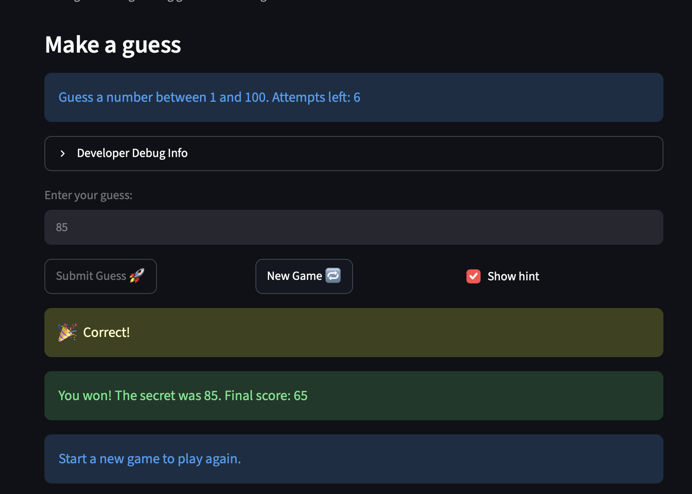

# 🎮 Game Glitch Investigator: The Impossible Guesser

## 🚨 The Situation

You asked an AI to build a simple "Number Guessing Game" using Streamlit.
It wrote the code, ran away, and now the game is unplayable. 

- You can't win.
- The hints lie to you.
- The secret number seems to have commitment issues.

## 🛠️ Setup

1. Install dependencies: `pip install -r requirements.txt`
2. Run the broken app: `python -m streamlit run app.py`

## 🕵️‍♂️ Your Mission

1. **Play the game.** Open the "Developer Debug Info" tab in the app to see the secret number. Try to win.
2. **Find the State Bug.** Why does the secret number change every time you click "Submit"? Ask ChatGPT: *"How do I keep a variable from resetting in Streamlit when I click a button?"*
3. **Fix the Logic.** The hints ("Higher/Lower") are wrong. Fix them.
4. **Refactor & Test.** - Move the logic into `logic_utils.py`.
   - Run `pytest` in your terminal.
   - Keep fixing until all tests pass!

## 📝 Document Your Experience

- Purpose: A Streamlit number guessing game where you guess a secret number within a limited number of attempts, using higher/lower hints. Difficulty sets the range and attempts.
- Bugs: Inverted hints, no range check on guesses, New Game didn't reset the session, and attempts could go negative.
- Fixes: Swapped the hint messages, added bounds checking to parse_guess, added a reset_game() helper, and clamped attempts at 0 while disabling input when the game ends. Each fix is marked with a # FIX: comment in app.py.

## 📸 Demo Walkthrough

Describe your fixed game in numbered steps so a reader can follow along without watching a video:

1. User chooses game difficulty
2. User enters a guess of 21
3. Game returns "Go HIGHER!"
4. User enters a guess of 99, and the game returns "Go LOWER!"
5. Game ends when user guesses the secret number or run out of attempts
6. User can start a new game

**Screenshot** *(optional)*:



## 🧪 Test Results

```
# Paste your pytest output here, e.g.:
# pytest tests/
# ========================= X passed in 0.XXs =========================
```

## 🚀 Stretch Features

- [ ] [If you choose to complete Challenge 4, describe the Enhanced UI changes here — a screenshot is optional]
